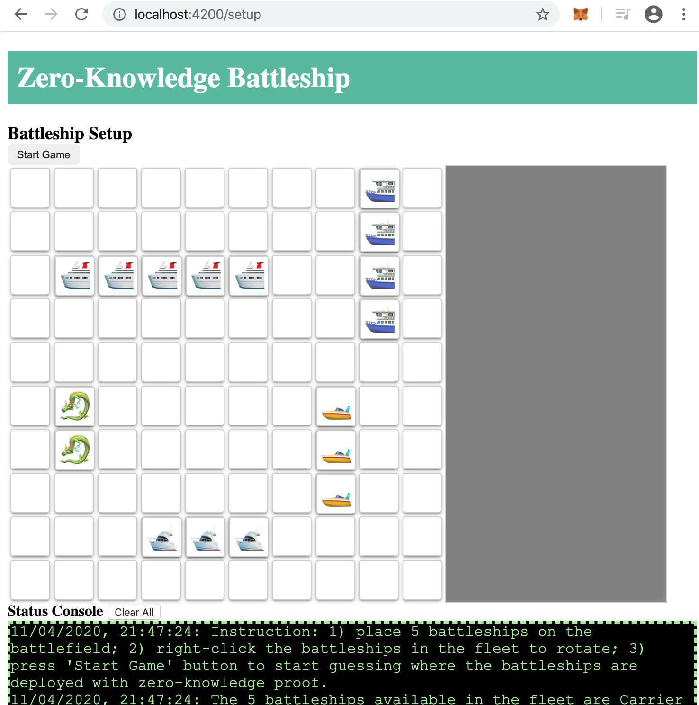

# zkbattleship

[](https://creativecommons.org/licenses/by-sa/4.0/)

`zkbattleship` is a prototype [Battleship](https://en.wikipedia.org/wiki/Battleship_(game)) game built on zkSNARKs proof and verification. Battleship game requires the players to be honest in reporting whether the hits from enemies successfully damaged the battleships or not. zkSNARKs proof enables solid verification without revealing enemies' battleship deployment.

It features the use of [Angular 8](https://angular.io) for web frontend, [web3.js](https://web3js.readthedocs.io) for smart contract interaction and [snarkjs](https://github.com/iden3/snarkjs) for zkSNARKs proof and verification.

See also [zkbattleship-circuit](https://github.com/tommymsz006/zkbattleship-circuit) for the underlying arithmetic circuit implementation used in zkSNARKs.

## Prerequisite

No prior package installation is required, as it can be built via npm commands and operated via [Angular CLI](https://github.com/angular/angular-cli). For Angular CLI in particular, see more in the article [Setting up the local environment and workspace](https://angular.io/guide/setup-local) at Angular website.

The verification of battleship deployment needs a Web3-compatible provider/wallet, such as [Metamask](https://metamask.io). This allows the web client to interact with the verifier smart contract.

The verifier smart contract generated from [zkbattleship-circuit](https://github.com/tommymsz006/zkbattleship-circuit) can be deployed in local Ethereum blockchain (e.g. [ganache-cli](https://github.com/trufflesuite/ganache-cli)) or testnet (e.g. [Kovan](https://kovan-testnet.github.io/website/)). See more at [Contract Deployment](https://github.com/tommymsz006/zkbattleship-circuit#contract-deployment).

## Structure

The structure of this project follows standard Angular project.

* `src/app` includes majority of the code around [components](https://angular.io/guide/architecture-components) and [services](https://angular.io/guide/architecture-services).
* `src/assets` contains the necessary objects used by `snarkjs` for zkSNARKs proof.
* `docs` has the materials used by this README.

## Build

1. Git-clone the content to local storage and build via npm:

```bash
npm install
```
2. In `node_modules/@angular-devkit/build-angular/src/angular-cli-files/models/webpack-configs/browser.js`, replace

```javascript
node: false
```

by

```javascript
node: {crypto: true, stream: true}
```

to ensure that web3.js works with Angular. See more technical details at [here](https://github.com/ethereum/web3.js/issues/1555).

3. Compile code and start an interactive local development server:

```bash
ng serve
```

## Run

Once the local development server is up using `ng serve`, access [http://localhost:4200](http://localhost:4200).



Here are some instructions for running through the game features:

1. place 5 battleships (Carrier 🛳️, Battleship ⛴️, Cruiser 🛥️, Submarine 🚤 and Destroyer 🐉) on the battlefield from the fleet;
2. right-click the battleships in the fleet to rotate;
3. press 'Start Game' button to start guessing where the battleships are deployed with zero-knowledge proof;
4. choose between JavaScript and Web3 for verification; for Web3
   * enter contract address of the verifier (i.e. `verifier.sol` in [zkbattleship-circuit](https://github.com/tommymsz006/zkbattleship-circuit))
5. pick the tile in each turn to observe whether it hits the hidden battleships
   * red is a hit, amber is a miss;
   * further zkSNARKs verification will take place; the state is indicated by Generating Proof (⏳), Verifying (🔵), Verified-Valid (✅) and Verified-Invalid (✖️)
